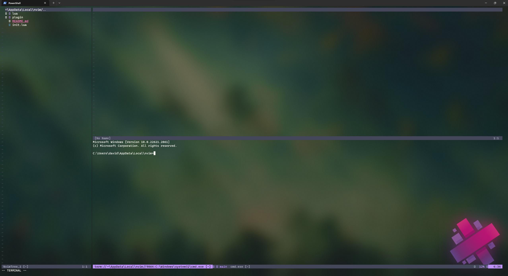

# nvim-setup
Setup for nvim

## Plugins

- fzf
- treesitter
- dracula
- lualine
- packer
- nvim-tree

## Keybinds

- **Ctrl + n**: Opens the tree view
- **Ctrl + p**: Opens the file searcher
- **Alt + q**: Opens a terminal

